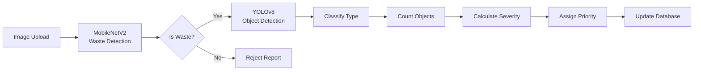

# System Workflow & Architecture

## Complete Process Flow

### 1. **Report Waste** (Citizen)
```
Citizen → Capture Image + GPS → Upload to System
         ↓
    AI Verification
         ↓
    Waste Classification
         ↓
    Severity Analysis
         ↓
    Priority Assignment
```

**Steps:**
1. User opens "Report Waste" screen
2. Takes photo using device camera
3. GPS automatically captures location
4. Submits report with description
5. System processes image through AI pipeline

**AI Processing:**
- **MobileNetV2**: Waste vs Non-Waste Detection
- **YOLOv8**: Object Detection & Type Classification
- **Severity Calculator**: Analyzes waste amount and type
- **Priority Assigner**: Sets urgency level (1-5)

**Reward Points:** +10 base points (multiplied by severity)

---

### 2. **AI Verification** (Automated)



**Severity Levels:**
- **Critical**: Hazardous waste or large amounts (Priority 1)
- **High**: Electronic waste or significant quantity (Priority 2)
- **Medium**: Moderate plastic/mixed waste (Priority 3)
- **Low**: Small amounts of recyclables (Priority 4)
- **Minimal**: Minor litter (Priority 5)

---

### 3. **Waste Classification** (Automated)

**Categories:**
- 🟡 **Plastic** - Bottles, bags, containers
- 🟢 **Organic** - Food waste, leaves, biodegradable
- 🔴 **Hazardous** - Chemicals, batteries, medical waste
- 📱 **Electronic** - E-waste, circuit boards
- ⚪ **Other** - Mixed or unidentified waste

**Classification Pipeline:**
1. Image preprocessed (224x224 RGB)
2. Feature extraction via CNN
3. Multi-class prediction
4. Confidence scoring
5. Category assignment

---

### 4. **Assign Cleanup Task** (Admin/Automated)

```
Report Created → Priority Queue → Find Available Cleaner
                                          ↓
                                   Calculate Distance
                                          ↓
                                   Assign Task
                                          ↓
                                   Notify Cleaner
                                          ↓
                                   Update Map
```

**Assignment Logic:**
1. Sort reports by priority (1 = urgent)
2. Find cleaners in radius (default 10km)
3. Match based on:
   - Proximity to waste location
   - Current workload
   - Specialization (hazardous certified)
4. Send push notification
5. Update task status to "assigned"

**Integration:**
- **Google Maps API**: Real-time distance calculation
- **Traffic Analysis**: Optimal route planning
- **Location Tracking**: Live cleaner positions

---

### 5. **Cleaner Workflow**

```
Task Assigned → View on Map → Navigate → Start Task
                                              ↓
                                         Clean Area
                                              ↓
                                    Take After Photo
                                              ↓
                                     Upload & Complete
```

**Steps:**
1. Receive notification
2. View task details (location, severity, type)
3. Navigate using integrated map
4. Mark task as "In Progress"
5. Perform cleanup
6. Take "after" photo from same angle
7. Submit completion

---

### 6. **After-Clean Verification** (Automated)

```
Before Image → Siamese Network → After Image
                     ↓
           Compare Features
                     ↓
           Calculate Difference
                     ↓
           Cleanup Quality Score
                     ↓
           Award Points
```

**Siamese Network Process:**
1. Extract features from both images
2. Calculate L1 distance
3. Similarity score (0-1)
4. Quality assessment:
   - **Excellent** (90-100%): 2x points multiplier
   - **Good** (80-89%): 1.5x multiplier
   - **Partial** (60-79%): 1.2x multiplier
   - **Insufficient** (<60%): 0.5x multiplier

**Reward Points:** +20 base points (× quality multiplier × severity)

---

## ML Models Architecture

### Model 1: MobileNetV2 (Waste Detection)
```
Input: 224x224x3 RGB Image
       ↓
MobileNetV2 Base (pretrained)
       ↓
Global Average Pooling
       ↓
Dense(256) + ReLU
       ↓
Dropout(0.5)
       ↓
Dense(2) [Waste/Non-Waste]
       ↓
Output: Binary Classification
```

### Model 2: YOLOv8 (Object Detection & Severity)
```
Input: Image (any size)
       ↓
YOLOv8 Backbone
       ↓
Feature Pyramid Network
       ↓
Detection Heads
       ↓
Output: [BBox, Class, Confidence]
       ↓
Post-processing:
  - NMS (Non-Max Suppression)
  - Class filtering
  - Count objects
       ↓
Severity Analysis:
  - Count by type
  - Calculate coverage
  - Apply multipliers
       ↓
Output: Severity + Priority
```

**Waste Classes (8 types):**
0. Plastic
1. Organic
2. Electronic
3. Hazardous
4. Metal
5. Glass
6. Paper
7. Other

### Model 3: Siamese Network (Before/After Comparison)
```
Before Image (224x224x3)    After Image (224x224x3)
         ↓                              ↓
    Feature Extractor              Feature Extractor
    (Shared Weights)              (Shared Weights)
         ↓                              ↓
    Features(128)                  Features(128)
         ↓                              ↓
         └──────────> L1 Distance <──────────┘
                          ↓
                     Dense(64)
                          ↓
                     Dense(32)
                          ↓
                     Dense(1) + Sigmoid
                          ↓
                  Similarity Score
                          ↓
              Cleanup Quality = 1 - Similarity
```

---

## API Workflow

### Report Submission Flow
```
POST /api/reports
    ↓
Upload images + GPS + description
    ↓
Save to database
    ↓
Async: Call AI Service
    ↓
POST /api/analyze-full (AI Service)
    ↓
Returns: {classification, detection, severity}
    ↓
Update report with AI data
    ↓
Calculate reward points
    ↓
Award points to citizen
    ↓
Notify admin of new report
    ↓
Return success response
```

### Cleanup Completion Flow
```
PUT /api/reports/:id/complete
    ↓
Upload after image
    ↓
POST /api/verify-cleanup (AI Service)
    ↓
Returns: {cleanup_quality, is_cleaned, status}
    ↓
Update report with verification
    ↓
Calculate completion points
    ↓
Award points to cleaner
    ↓
Update status to "completed"
    ↓
Notify citizen (report resolved)
    ↓
Return success response
```

---

## Database Schema

### Report Document
```javascript
{
  _id: ObjectId,
  title: String,
  description: String,
  category: Enum[plastic, organic, electronic, hazardous, other],
  status: Enum[pending, assigned, in-progress, completed, rejected],
  
  location: {
    type: "Point",
    coordinates: [longitude, latitude],
    address: String
  },
  
  images: [{
    url: String,
    uploadedAt: Date
  }],
  
  aiVerification: {
    verified: Boolean,
    confidence: Number,
    wasteCount: Number,
    detectedItems: [{item: String, confidence: Number}],
    severity: {
      level: Enum[none, minimal, low, medium, high, critical],
      score: Number,
      dominantType: String,
      wasteDistribution: Map
    },
    priority: Number (1-5)
  },
  
  reportedBy: ObjectId(User),
  assignedTo: ObjectId(User),
  
  beforeImage: String,
  afterImage: String,
  
  cleanupVerification: {
    verified: Boolean,
    cleanupQuality: Number (0-100),
    status: Enum[none, insufficient, partial, good, excellent],
    rewardMultiplier: Number,
    verifiedAt: Date
  },
  
  rewardPoints: {
    basePoints: Number,
    bonusPoints: Number,
    totalPoints: Number,
    awarded: Boolean
  },
  
  createdAt: Date,
  completedAt: Date
}
```

---

## Reward Points System

### Points Calculation

**Report Submission:**
```
Base Points = 10
× Severity Multiplier (critical: 2.0, high: 1.5, medium: 1.2, low: 1.0)
× Category Multiplier (hazardous: 2.0, electronic: 1.5, plastic: 1.0)
+ Verification Bonus = 5 points
```

**Cleanup Completion:**
```
Base Points = 20
+ Quality Bonus (excellent: 15, good: 10, partial: 5)
× Cleanup Multiplier (based on quality: 0.5 to 2.0)
× Severity Multiplier (harder cleanup = more points)
```

**Example:**
- Critical hazardous waste report: 10 × 2.0 × 2.0 + 5 = **45 points**
- Excellent cleanup (90%): (20 + 15) × 2.0 × 2.0 = **140 points**
- **Total: 185 points earned!**

---

## Real-Time Features

### Location Tracking
- Cleaners' live positions updated every 30 seconds
- Citizens can see cleaner approaching on map
- ETA calculation with traffic data

### Notifications
- **Citizens:** Report acknowledged, assigned, completed
- **Cleaners:** New task assigned, approaching reminder
- **Admins:** New reports, pending assignments

### Map Visualization
- Color-coded markers by severity
- Cluster view for dense areas
- Filter by status and category
- Heat map of waste concentration

---

## Technology Integration

```
┌─────────────────────────────────────────────────┐
│                Frontend (React)                  │
│  ┌─────────────┐  ┌──────────┐  ┌────────────┐ │
│  │   Screens   │  │ Map View │  │ Components │ │
│  └─────────────┘  └──────────┘  └────────────┘ │
└──────────────┬──────────────────────────────────┘
               │ REST API
┌──────────────┴──────────────────────────────────┐
│           Backend (Node.js/Express)              │
│  ┌──────────┐  ┌───────────┐  ┌──────────────┐ │
│  │  Routes  │  │Controllers│  │  Middleware  │  │
│  └──────────┘  └───────────┘  └──────────────┘  │
│  ┌──────────┐  ┌───────────┐                    │
│  │  Models  │  │  Services │                     │
│  └──────────┘  └───────────┘                     │
└──────┬─────────────┬────────────────┬───────────┘
       │             │                │
   ┌───┴───┐    ┌───┴────┐      ┌────┴────┐
   │MongoDB│    │AI Flask│      │ Google  │
   │       │    │Service │      │Maps API │
   └───────┘    └────┬───┘      └─────────┘
                     │
          ┌──────────┴────────────┐
          │     AI Models         │
          │ ┌─────────────────┐  │
          │ │ MobileNetV2     │  │
          │ │ YOLOv8          │  │
          │ │ Siamese Network │  │
          │ └─────────────────┘  │
          └──────────────────────┘
```

---

## Deployment Architecture

```
┌─────────────┐
│   Vercel    │  Frontend (Static Host)
└──────┬──────┘
       │ HTTPS
┌──────┴──────┐
│   Heroku    │  Backend API
└──────┬──────┘
       │
   ┌───┴────┬────────────┐
   │        │            │
┌──┴───┐ ┌─┴────┐ ┌─────┴─────┐
│MongoDB Atlas │Google│  AI API  │
│      │ │Cloud │ │(Docker)  │
└──────┘ └──────┘ └───────────┘
```

---

This workflow ensures:
✅ Automated waste detection and classification
✅ Priority-based task assignment
✅ Quality-verified cleanup completion
✅ Fair reward point distribution
✅ Real-time location tracking
✅ Efficient resource allocation
